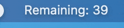

# 🧰 Tray

## What is the Tray

The Tray is the area where applications can put their icons to be easily accessed by users. On macOS this is the menubar and on Windows it's the system tray.

## todesktop.tray.setTitle(title)


Works on **macOS **only. Will throw on Windows & Linux


```javascript
todesktop.tray.setTitle('title')
```

## todesktop.tray.destroy()

This will destroy the tray item immediately

```javascript
todesktop.tray.destroy()
```

## Example: Building a tray timer

Suppose we wanted to show users a 60 second timer in the tray

```javascript

function startTimer () {
  let remainingTime = 60;
  let timer = setInterval(() => {
    // Set the tray title to the remaining time
    window.todesktop.tray.setTitle(
      `Remaining: ${remainingTime}`
    );
    
    remainingTime -= 1;
    if (remainingTime < 0) clearInterval(timer);
  }, 1000);
}
```

This will give you something like:


