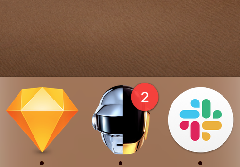

# ↔️ Add Browser Controls to your Desktop App

## Your desktop app is _not_ a web browser

A web browser has buttons to control page navigation such as back, forward and reload. Your desktop app's navigation buttons are up to you.

You may decide that you don't need page navigation because the design of your app doesn't require it. Sometimes, however, it's useful to be able to have back and forward buttons in your desktop app.

This guide will show you how to add browser navigation to your desktop app.

### Use your web apps codebase

A common question is “Where do I put the code for my desktop app”. The answer is that you put it in the same place that you put your web app code. You don't need to maintain a separate codebase.


Before you start you might want to read how to use ToDesktop's [CSS hooks](../customizing-your-app/adding-custom-css-to-your-desktop-app.md) and [Javascript hooks](../customizing-your-app/adding-custom-javascript-to-your-desktop-app.md). You can also read about how to [separate desktop logic from web app logic](separating-desktop-logic.md).


### HTML

First up let's add some simple HTML \(or JSX\) for our app buttons. You can put this snippet wherever you wish your navigation buttons to appear.



```markup
<div class="browser-navigation">
  <button class="history-back-button">
    ◀
  </button>
  <button class="history-forward-button">
    ▶
  </button>
</div>
```



```jsx
{
  // Only render this HTML if we are in the desktop app
  window.todesktop &&
  (
    <div className="browser-navigation">
      <button className="history-back-button">
        ◀
      </button>
      <button className="history-forward-button">
        ▶
      </button>
    </div>
  )
}
```



### Styles

Next up, we want to add some styles so that the buttons are hidden from our web app.

```css
.browser-navigation {
  /* HIDE navigation when in WEB app */
  display: none;
}

html.todesktop .browser-navigation {
  /* Overrides above style when in desktop mode */
  /* SHOW navigation when in DESKTOP app */
  display: block;
}
```

We can add some more styles to make our buttons look how we want them to look.

```css
.browser-navigation button {
  height: 26px;
  width: 26px;
  font-size: 13px;
  background: #ddd;
  cursor: pointer;
  border: none;
  border-radius: 50%;
  line-height: 20px;
  text-align: center;
  outline: none;
}

.browser-navigation button:hover {
  background: #ccc;
}
```



### Making it work

Now let's make our buttons actually work. We can use ToDesktop's goBack\(\) and goForward\(\) methods to go back or forward through our navigation history.

```javascript
if (window.todesktop) {
  // This block is only executed when running as a desktop app
  
  const backBtn =
    document.querySelector(".history-back-button");
  const forwardBtn =
    document.querySelector(".history-forward-button");

  backBtn.addEventListener("click", () => {
    // Go back when back button is clicked
    window.todesktop.contents.goBack();
  });
  
  forwardBtn.addEventListener("click", () => {
    // Go Forward when forward button is clicked
    window.todesktop.contents.goForward();
  });
}
```

### Make buttons disabled when they are not navigable

Everything works exactly as it should 🎉. However, what if we are at the most recent position in history and we can't go forward? We should communicate that to our users and make the button disabled.

#### Listen for navigation changes

We use the `"did-navigate"` event to make sure that the code below runs every-time that we navigate to a new page in our desktop app.

We then check if we can `canGoForward()` and if we `canGoBack()`. Based on the return boolean of these methods we make the button disabled or not.

```javascript
if (window.todesktop) {
  // This block is only executed when running as a desktop app

  window.todesktop.on("did-navigate", async () => {
    // This block is executed everytime that the desktop app navigates to a new page
  
    const btnForward =
      document.querySelector(".history-forward-button");
      
    if (await window.todesktop.contents.canGoForward()) {
      btnForward.disabled = false;
    } else {
      btnForward.disabled = true;
    }
  
    const btnBack =
      document.querySelector(".history-back-button");
      
    if (await window.todesktop.contents.canGoBack()) {
      btnBack.disabled = false;
    } else {
      btnBack.disabled = true;
    }
  });
  
}
```

#### Disabled button styles

Finally, let's add some more styles to our buttons so that they are faded when disabled.


```css
.browser-navigation button:disabled {
  opacity: 0.5;
  cursor: default;
}

.browser-navigation button:disabled:hover {
  background: #ddd;
}
```


