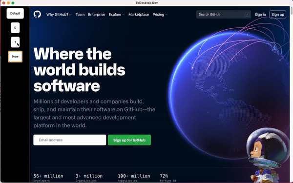
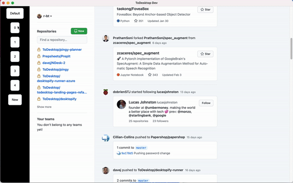

# 👪 Building a Slack-like sidebar

If your app allows users to sign into multiple accounts then you need an easy way for them to switch between. Having a sidebar of accounts is a great solution. Here we're going to build a basic application to manage multiple GitHub logins


The BrowserViews API is in beta and may change (or be completely removed) without warning.


## Scaffolding

To begin we need to describe where the sidebar and content go, ToDesktop lets you do this using HTML and CSS, like you're used to.

**index.html:**

```markup
<div 
  class="sidebar"
  data-view-url="http://localhost:3000/sidebar.html"
  data-view-id="sidebar"
>
</div>
<div
  class="main"
  data-view-url="https://github.com/"
  data-view-id="content"
  data-view-partition="default"
>
</div>

<style>
  body {
    margin: 0;
    padding: 0;
  }

  .container {
    width: 100vw;
    height: 100vh;
    display: flex;
  }
  
  .sidebar {
    width: 10vw;
    height: 100vh;
  }
  
  .main {
    width: 90vw;
    height: 100vh;
  }
</style>


```

Here we create two sections: the sidebar and content. We use `data-view-url` to tell ToDesktop where the content of these views come from. Each section can be thought of like a _tab _running independently from each other. 

We use `data-view-partition` to set the default _partition _for a view. Each partition has its own cookies, localStorage, etc. By changing the partition we can swap accounts.

## Initializing the views

You need to tell ToDesktop to change these into **views**

```javascript
window.onload = () => {
  window.todesktop.views.init();
}
```

## Sidebar

The sidebar is where we'll show users a list of their accounts and let them add new accounts

**sidebar.html:**

```markup
<html>
  <body>
    <ul id="accountsList">
      <li class="profile" id="default">
        <button>Default</button>
      </li>
      <li class="profile" id="new">
        <button>New</button>
      </li>
    </ul>
  </body>
  <style>
    ul {
      padding: 0;
      list-style-type: none;
      display: flex;
      flex-direction: column;
      justify-content: center;
      align-items: center;
    }
    
    li.profile {
      background-color: white;
      border-radius: 7px;
      height: auto;
      box-sizing: border-box;
      margin-bottom: 1rem;
    }

    button {
      border: none;
      padding: 1rem;
      background: transparent;
    }
  </style>
</html>
```

## Seeing the app

Serve the project to `localhost:3000` (or whatever address you prefer and change `data-view-url` to that url) and run the development ToDesktop app pointed at `localhost:3000`


## Adding accounts

If you're using `react`,`svelte`,etc then you can do this easier but for this example we'll use plain JavaScript. 

**sidebar.html:**

```markup
...
</ul>
<script>
  window.onload = () => {
    const newButton = document.getElementById("new");
    const list = document.getElementById("accountsList");
    // To persist the added accounts we'll add them to
    // localStorage
    let accounts = JSON.parse(localStorage.getItem("accounts"));
    /* accounts: {
     *    id: string,
     *    name: string,
     * }[]
     */

    // Ensure accounts is an array (e.g. on load when accounts
    // is undefined)
    if (!Array.isArray(accounts)) accounts = [];

    // We'll come back to this below
    const switchAccount = () => {};
    document
      .getElementById("default")
      .childNodes[0].addEventListener("click", switchAccount);

    const createID = () => "_" + Math.random().toString(36).substr(2, 9);

    // This creates new <li> elements and adds
    // the click event handler
    const createElement = (account) => {
      const li = document.createElement("li");
      li.id = account.id;
      li.classList.add("profile");
      const button = document.createElement("button");
      button.addEventListener("click", switchAccount);
      button.innerHTML = account.name;
      li.appendChild(button);
      return li;
    };

    const addAccountsToDom = () => {
      // We only want to add accounts that aren't already
      // in the dom. So we'll filter accounts by ids in
      // the DOM
      const ids = Array.from(
        document.querySelectorAll("#accountsList > li")
      ).map(({ id }) => id);
      const accountsToAdd = accounts.filter(({ id }) => !ids.includes(id));
      // We'll add new <li>s as elements before new button
      accountsToAdd.forEach((account) => {
        list.insertBefore(createElement(account), newButton);
      });
    };
    addAccountsToDom();

    // Create new accounts when new button pressed
    newButton.addEventListener("click", () => {
      accounts.push({
        name: accounts.length,
        id: createID(),
      });
      localStorage.setItem("accounts", JSON.stringify(accounts));
      addAccountsToDom();
    });
  };
</script>
```

With this we can click the **New **button to add new buttons to the sidebar representing accounts. We give each account an id which will we later use for partitions. Finally, we save the accounts to localStorage to access on subsequent app opens.



## Switching Accounts

ToDesktop provides some APIs for interacting with **views. **We'll be using `todesktop.views.switch`

**sidebar.html:**

```javascript
...
const switchAccount = () => {
  // Get the id of the button's <li> parent
  const { id } = e.currentTarget.parentElement;
         
  window.todesktop.views.switch({
    id: "content", // The data-view-id from index.html
    url: "https://github.com",
    partition: id,
  });
}
```



## Finish

And there, you've now build an app using ToDesktop to switch between multiple Github accounts. You can try it out, create some accounts in the sidebar, switch between them and sign into different GitHub accounts. 🥳
