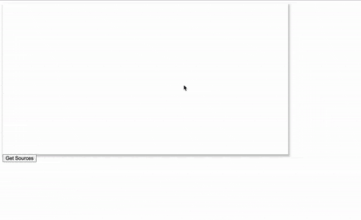

# 🔴 Capture Screen Contents

Get the user's media access status

```javascript
todesktop.systemPreferences.getMediaAccessStatus(
    'screen'
);
```

This will return a `Promise` which will resolve to `not-determined`, `granted`, `denied`, `restricted` or `unknown`

On Windows and macOS 10.14 Mojave or lower the response will always be`granted` . macOS 10.15 Catalina or higher requires consent for `screen` access. 

To get that consent just run the code below, it will automatically ask for permission

## Get the user's screen sources

Say we wanted to get a user's screens and windows

```javascript
const sources = await todesktop.desktopCapturer.getSources({
    types: ["window", "screen"],
    thumbnailSize: {
      height: 720,
      width: 1000,
    },
});
```

This will return an array of sources

```bash
[
    {
        appIcon: null,
        display_id: "",
        id: "window:60230:0",
        name: "Developer Tools - http://localhost:3000/",
        thumbnail: "data:image/png;base64,iV..."
    },
    ...
]
```

## Getting a source id

You'll need a way of choosing which screen/window to capture. Unlike in a browser, your Desktop app will need to implement its own UI for this.

For example if you wanted to reproduce a browsers selection feature you could loop through the sources and listen to `click` events on each.

```markup
<div id="desktop-capturer-sources"></div>

<button id="get-sources">Get Sources</button>

<style>
  #desktop-capturer-sources {
    display: flex;
    width: 60%;
    height: 400px;
    background-color: white;
    box-shadow: #c4c4c4 2px 4px 5px 2px;
    flex-wrap: wrap;
    overflow: auto;
    justify-content: center;
  }

  .desktop-source {
    min-width: 30%;
    padding: 1rem;
    margin: 0.25rem;
  }

  .desktop-source > img {
    width: 250px;
  }
</style>

<script>
  window.onload = () => {
    document
      .getElementById("get-sources")
      .addEventListener("click", () => getSources());
  };

  const getSources = async () => {
    const sources = await ...;
    const container = document.getElementById("desktop-capturer-sources");
    sources.forEach((source) => {
      const el = document.createElement("div");
      el.className = "desktop-source";
      const img = document.createElement("img");
      img.src = source.thumbnail;
      el.appendChild(img);
      // We'll create the getStream func later
      el.addEventListener("click", () => getStream(source.id));
      container.appendChild(el);
    });
  };
</script>
```

This will give you something like:



## Get the stream to a source

After choosing a source we'll use its `id` and  `navigator.mediaDevices.getUserMedia` to get the stream.

```javascript
const getStream = async (id) => {
  let stream = await navigator.mediaDevices.getUserMedia({
    audio: false,
    video: {
      mandatory: {
        chromeMediaSource: "desktop",
        chromeMediaSourceId: id,
        minWidth: 1280,
        maxWidth: 1280,
        minHeight: 720,
        maxHeight: 720,
      },
    },
  });
}
```

## Play the stream

If you have a `<video>` in your `HTML` you can then use

```bash
const video = document.querySelector("video");
video.srcObject = stream;
video.onloadedmetadata = (e) => video.play();
```

## API Reference

### `todesktop.desktopCapturer.getSources`

Exposes the `destopCapturer.getSources` electron API: [https://www.electronjs.org/docs/api/desktop-capturer](https://www.electronjs.org/docs/api/desktop-capturer)

Accepts an options object:

* `types` String\[\] - The types of desktop sources to be captured, either`screen` or `window`.
* `thumbnailSize` {width: number, height: number} \(optional\) - Default is `150` x `150`.
* `fetchWindowIcons` Boolean \(optional\) - Default value is `false`

Returns a `Promise` which resolves into an array of `DesktopCapturerSource` objects each having:

* `id` String - The id of a window or screen that can be used as a `chromeMediaSourceId` later
* `name` String - The name of the screen \(`Entire Screen` or `Screen <index>`\) or the window's title
* `thumbnail` String - A data Url of the image
* `display_id` String - A unique identifier that will correspond to the `id` property
* `appIcon` String - A data Url of the app Icon or `null` if type is screen


