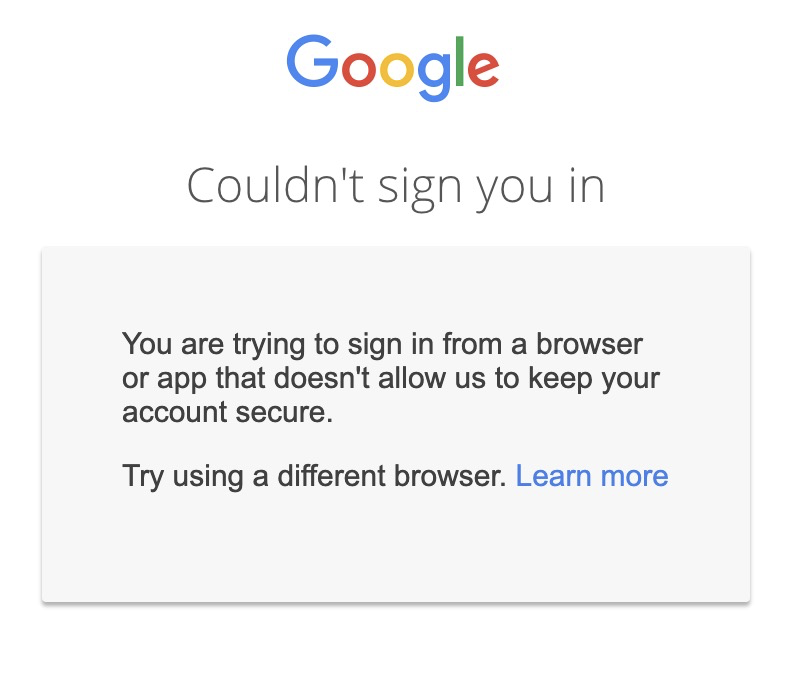

# 🔒 Google OAuth Screen

## Backstory

Starting on **January 4th 2021 **Google began blocking Google account sign-ins from embedded browsers including Electron (the framework ToDesktop uses under the hood)


Google's Announcement


If you previously showed your users a Google sign in screen inside your app they might now be seeing a warning telling them that Google doesn't allow sign ins from insecure browsers. 



In order to continue allowing your users to sign into your desktop app with Google you'll have to move the sign in flow to the user's default browser.

## Enable Open Google OAuth Screen in Browser & set an App Protocol

We need to ensure all Google OAuth links open in the user's default browser and set an [app protocol](https://docs.todesktop.com/app-options/app-protocols-and-deeplinks) so we can get back to your Desktop app from the browser.

1. Go to [https://app.todesktop.com](https://app.todesktop.com) and select your app. 
2. Tick the checkbox for_ Open Google OAuth Screen in Browser _in **App Options**
3. Tick the checkbox for _Support App Protocol _and enter a protocol 
   1. **E.g: **`todesktop://`


## Redirect instead of showing prompt

This depends on how you've implemented sign in with google but the key thing is that you need to sign in with a **redirect** not with a prompt. 

For ToDesktop's App we use Firebase. Firebase has a function `firebase.auth().signInWithRedirect(googleProvider)` which seems like it would do the job however the redirect doesn't include the `id_token` so instead we have to do the authentication [manually](https://firebase.google.com/docs/auth/web/google-signin#expandable-2)

#### 1.  Load the Google Platform Library

```javascript
<script src="https://apis.google.com/js/platform.js" async defer></script>
```

#### 2. Sign in with GAPI

```javascript
const signInToGoogle = () => {
    if (window.todesktop) {
        gapi.load("auth2", () => {
            gapi.auth2.init({
                client_id: 'xxxxxxxxxx-xxxxxx',
                ux_mode: 'redirect', // IMPORTANT!
                redirect_uri: 'http://yourapp.com/desktopLogin',
            })
            .then(() => {
                const auth = gapi.auth2.getAuthInstance()
                auth.signIn()
            })
        })
    } else {
        // Do your normal web-app flow
    }
}
```

Here we use `window.todesktop` to check if we're in the Desktop app. If so, we load `auth2` into GAPI, initialize it with our project's client id, and then get an auth  instance and start the redirect sign in.  

You can find your project's Google Client ID in your Project's Developers Console [Credentials page](https://console.developers.google.com/apis/credentials?project=\_).


If you're using typescript you can add [@types/gapi](https://www.npmjs.com/package/@types/gapi) and [@types/gapi.auth2](https://www.npmjs.com/package/@types/gapi.auth2) to the `types` field in your `tsconfig.json`


#### 3. Add a new redirect URL to your project

In your project's Developer Console [Credentials page](https://console.developers.google.com/apis/credentials?project=\_) click the OAuth 2.0 Client that you're using and add a desktop specific redirect URL to **Authorised redirect URIs**


After signing in Google will redirect users to this URL with `id_token` as a hash parameter e.g:`http://localhost:3000/desktopLogin#scope=email&id_token=xxxxx-xxxxxx`)

#### 4. Redirect back to your Desktop App

On your redirect page you'll want to tell your users that the login succeeded and then open up your Desktop app using an app protocol. The info you want to pass back depends your implementation

**Firebase:**

All Firebase needs is the `id_token`

```javascript
const hash = window.location.hash.substr(1);

// Convert hash parameters to key/value pairs
const result = hash.split("&").reduce(function (res, item) {
  const parts = item.split("=");
  res[parts[0]] = parts[1];
  return res;
}, {});

const token = result["id_token"];
if (token) {
  window.location.href = `
    todesktop://login?id_token=${token}
  `; // Use the app protocol you specified before
}
```

**2. GAPI**

GAPI handles signing in based off a redirect automatically so you'll need to open your Desktop app with the whole url

```javascript
const hash = window.location.hash.substr(1);

window.location.href = `
    todesktop://login?${hash}
  `; // Use the app protocol you specified before
```

## Sign the Desktop app in using the id token

Once your Desktop app has opened you'll want to finally sign in

### Firebase

#### Install query-string

```bash
$ npm install query-string
```

#### Get the id token

```javascript
import queryString from "query-string";

const query = queryString.parse(window.location.search);

const idToken = query["id_token"]
if (window.todesktop && idToken) {
   const credential = firebase.auth.GoogleAuthProvider.credential(idToken);
   firebase.auth().signInWithCredential(credential);
}
```

### GAPI

GAPI does this automatically once it has been initialized

```javascript
gapi.load("auth2", () => {
    gapi.auth2.init({
        client_id: 'xxxxxxxxxx-xxxxxx',
        ux_mode: 'redirect', // IMPORTANT!
        redirect_uri: 'http://yourapp.com/desktopLogin',
    })
})
```
